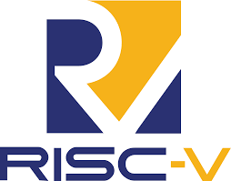
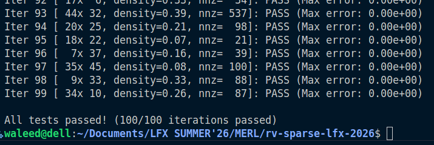

# RV-Sparse LFX 2026 Coding Challenge

<p align="center">
  
</p>

This repository contains my solution for the RV-Sparse LFX Summer 2026 coding challenge.

The task was to:

- Scan a dense row-major matrix
- Extract non-zero elements into CSR (Compressed Sparse Row) format
- Compute sparse matrix-vector multiplication
- Perform all operations without dynamic memory allocation inside the implementation

## Implementation

The `sparse_multiply()` function performs CSR extraction and matrix-vector multiplication in a single traversal of the matrix.

CSR representation uses:

- `values[]` for non-zero values
- `col_indices[]` for column indices
- `row_ptrs[]` for row boundaries

The implementation stores all non-zero elements in caller-provided buffers and computes:

```text
y = A × x
```

during the same pass over the matrix.

## Build and Run

```bash
gcc challenge.c -o run -lm
./run 
```
## Output 
Output clearly shows that All the tests have been passed .

<p align="center">
  
</p>

## Notes
No dynamic memory allocation is used inside `sparse_multiply()` CSR extraction and multiplication are fused into a single pass
The implementation is intended as a clean baseline for future RVV-based sparse optimizations

I have written Blogs on it where I went in the complete detail of the concept and my code implementation . Please have a look at it .